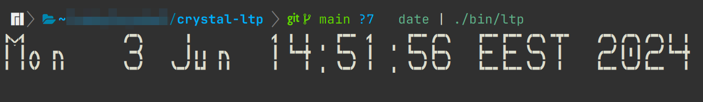
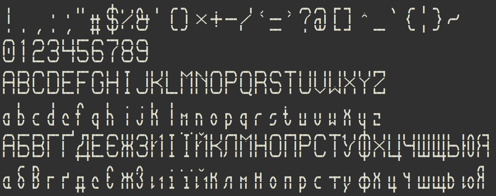

# ltp - Large Type Pieces

[](https://github.com/mamantoha/crystal-ltp/actions/workflows/crystal.yml)

`ltp` is a Crystal library to display characters in a 3x3 format in the terminal using large type pieces characters only.
This library provides a visually distinct way to present large, block-style characters, making terminal outputs more visually engaging.

## Installation

Add this to your application's `shard.yml`:

```yaml
dependencies:
  ltp:
    github: mamantoha/crystal-ltp
```

## Usage

```crystal
require "ltp"

LTP.print("Hello, World!")
```

This will output each character of "Hello, World!" in a 3x3 ASCII art format in your terminal.

You can use `ltp` to display large type characters by piping text input into the `ltp_cli.cr` script. Here's a quick example:

```
shards build
date | ./bin/ltp
```



## Character Support

```
crystal ./samples/symbols.cr
```



Currently, `ltp` supports only ASCII and Ukrainian letters. We are open to expanding the character set and welcome contributions.
If you're interested in adding support for more characters, please feel free to submit a pull request.

## Contributing

1. Fork it (<https://github.com/mamantoha/crystal-ltp/fork>)
2. Create your feature branch (`git checkout -b my-new-feature`)
3. Commit your changes (`git commit -am 'Add some feature'`)
4. Push to the branch (`git push origin my-new-feature`)
5. Create a new Pull Request

## Contributors

- [Anton Maminov](https://github.com/mamantoha) - creator and maintainer
